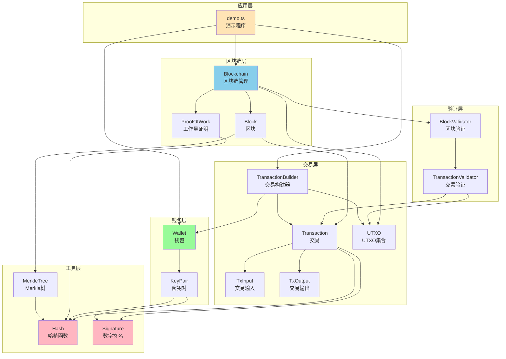
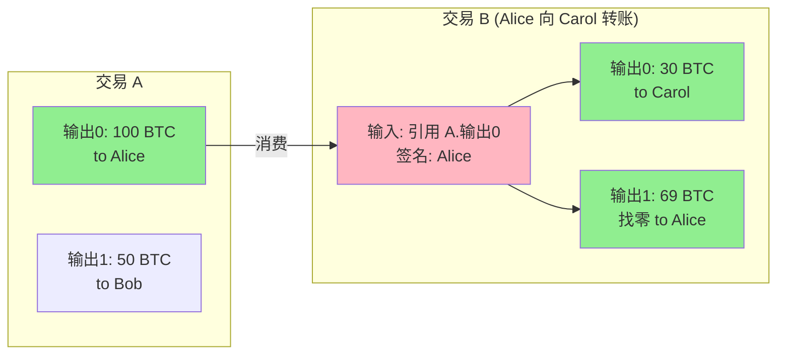
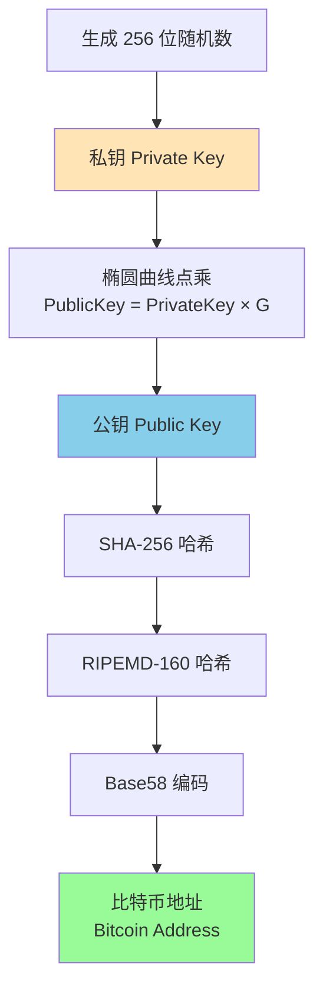
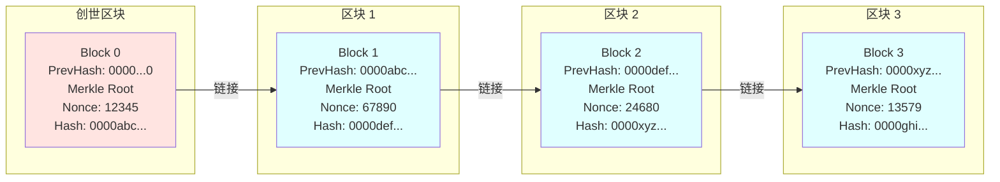
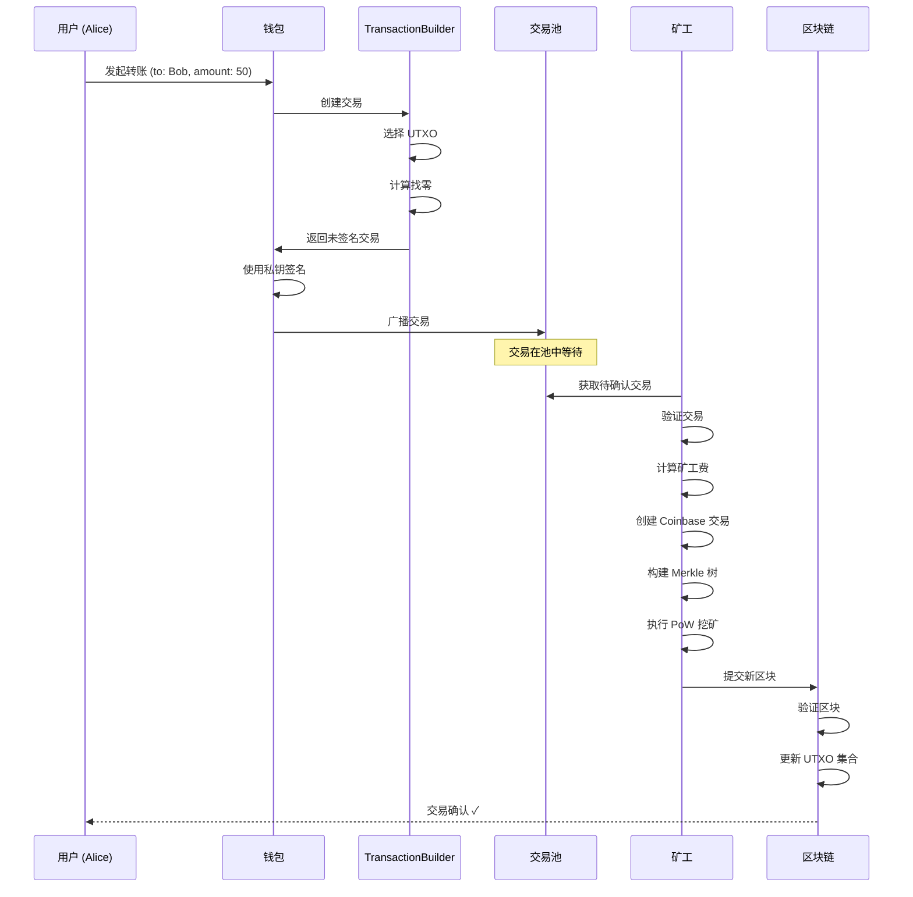
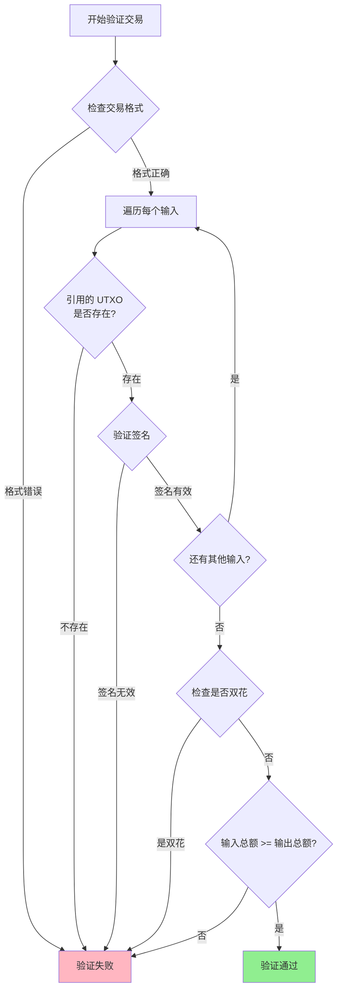
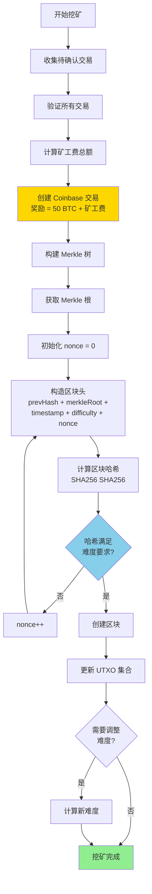

# 比特币系统技术设计文档

## 1. 系统概述

本项目是一个简化版的比特币系统实现，旨在展示比特币的核心技术原理。使用 TypeScript 实现，包含了 UTXO 模型、钱包系统、Merkle 树、工作量证明等核心组件。

### 1.1 核心特性

- **UTXO 模型**: 基于未花费交易输出的账户模型
- **椭圆曲线加密**: 使用 ECDSA (secp256k1) 进行数字签名
- **工作量证明**: 基于 SHA-256 的 PoW 共识机制
- **Merkle 树**: 高效的交易验证结构
- **动态难度调整**: 根据出块时间自动调整挖矿难度

### 1.2 系统整体工作流程


## 2. 系统架构

### 2.1 目录结构

```
bitcoin/
├── src/
│   ├── crypto/           # 密码学基础
│   │   ├── hash.ts       # 哈希函数
│   │   └── signature.ts  # 数字签名
│   ├── wallet/           # 钱包系统
│   │   ├── KeyPair.ts    # 密钥对
│   │   └── Wallet.ts     # 钱包
│   ├── transaction/      # 交易系统
│   │   ├── TxInput.ts    # 交易输入
│   │   ├── TxOutput.ts   # 交易输出
│   │   ├── UTXO.ts       # UTXO 集合
│   │   ├── Transaction.ts       # 交易
│   │   └── TransactionBuilder.ts # 交易构建器
│   ├── merkle/           # Merkle 树
│   │   └── MerkleTree.ts
│   ├── blockchain/       # 区块链核心
│   │   ├── Block.ts      # 区块
│   │   ├── Blockchain.ts # 区块链
│   │   └── ProofOfWork.ts # 工作量证明
│   ├── validator/        # 验证器
│   │   ├── BlockValidator.ts       # 区块验证
│   │   └── TransactionValidator.ts # 交易验证
│   └── examples/         # 示例
│       └── demo.ts       # 完整演示
└── docs/
    └── TECH_DESIGN.md    # 本文档
```

### 2.2 模块依赖关系图



## 3. 核心概念

### 3.1 UTXO 模型

UTXO (Unspent Transaction Output) 是比特币的核心账户模型。与传统的账户余额模型不同，UTXO 模型将每笔交易视为"消费旧输出，创建新输出"的过程。

**优势**:
- 天然支持并发处理（不同的 UTXO 可以并行验证）
- 易于检测双花攻击
- 隐私性更好（每次交易可以使用新地址）

**工作原理**:
1. 交易输入引用之前的 UTXO
2. 交易输出创建新的 UTXO
3. 输入总额必须 >= 输出总额
4. 差额作为矿工费

**UTXO 交易示意图**:



> 矿工费 = 100 - (30 + 69) = 1 BTC

### 3.2 数字签名 (ECDSA)

使用椭圆曲线数字签名算法 (ECDSA) 基于 secp256k1 曲线。

**密钥生成**:
1. 私钥: 256 位随机数
2. 公钥: 私钥 × G (G 是曲线的生成点)
3. 地址: Base58(RIPEMD160(SHA256(公钥)))

**签名流程**:
1. 计算交易哈希
2. 使用私钥对哈希进行签名
3. 生成签名 (r, s)

**验证流程**:
1. 使用公钥验证签名
2. 确认签名者拥有对应私钥

**地址生成流程图**:



### 3.3 Merkle 树

Merkle 树是一种二叉哈希树，用于高效验证区块中的交易。

**构建过程**:
```
        Root
       /    \
     H01    H23
    /  \   /  \
   H0  H1 H2  H3
   |   |  |   |
  Tx0 Tx1 Tx2 Tx3
```

**优势**:
- 只需 O(log n) 的哈希即可验证某笔交易是否在区块中
- 轻节点可以只下载区块头，按需验证交易

### 3.4 工作量证明 (PoW)

工作量证明通过计算满足特定条件的区块哈希来保护区块链安全。

**挖矿过程**:
1. 构造区块（包含交易、前区块哈希、Merkle 根等）
2. 不断尝试不同的 nonce 值
3. 计算区块哈希 SHA256(SHA256(区块头))
4. 当哈希值小于难度目标时，挖矿成功

**难度目标**:
- 表示为前导零的个数
- 例如：难度 4 表示哈希必须以 "0000" 开头

**难度调整**:
- 每 10 个区块调整一次
- 目标出块时间: 10 秒
- 调整公式: `新难度 = 旧难度 × (目标时间 / 实际时间)`

**区块链结构示意图**:



## 4. 数据结构

### 4.1 交易输入 (TxInput)

```typescript
interface TxInput {
  txId: string;        // 引用的交易 ID
  outputIndex: number; // 引用的输出索引
  signature: string;   // 签名
  publicKey: string;   // 公钥
}
```

### 4.2 交易输出 (TxOutput)

```typescript
interface TxOutput {
  amount: number;   // 金额
  address: string;  // 接收地址
}
```

### 4.3 交易 (Transaction)

```typescript
interface Transaction {
  id: string;           // 交易 ID (交易内容的哈希)
  inputs: TxInput[];    // 输入列表
  outputs: TxOutput[];  // 输出列表
  timestamp: number;    // 时间戳
}
```

### 4.4 区块 (Block)

```typescript
interface Block {
  version: number;           // 版本号
  previousHash: string;      // 前区块哈希
  merkleRoot: string;        // Merkle 根
  timestamp: number;         // 时间戳
  difficulty: number;        // 难度
  nonce: number;             // 随机数
  transactions: Transaction[]; // 交易列表
  hash: string;              // 区块哈希
}
```

**区块结构详细图**:

```
┌─────────────────────────────────────────────────────────┐
│                      区块头 (Block Header)                │
├─────────────────────────────────────────────────────────┤
│  Version: 1                                             │
│  Previous Hash: 0000abc123...                           │
│  Merkle Root: def456789...                              │
│  Timestamp: 1700000000                                  │
│  Difficulty: 4                                          │
│  Nonce: 123456                                          │
├─────────────────────────────────────────────────────────┤
│                     区块哈希 (Block Hash)                 │
│              0000xyz987... (通过 PoW 计算)               │
├─────────────────────────────────────────────────────────┤
│                      交易列表 (Transactions)              │
├─────────────────────────────────────────────────────────┤
│  [0] Coinbase 交易 (矿工奖励)                            │
│      ├─ Inputs: []                                      │
│      └─ Outputs: [50 BTC -> Miner Address]             │
├─────────────────────────────────────────────────────────┤
│  [1] 普通交易                                            │
│      ├─ Inputs: [ref TX_A output 0]                    │
│      └─ Outputs: [30 BTC -> Bob, 19 BTC -> Alice]      │
├─────────────────────────────────────────────────────────┤
│  [2] 普通交易                                            │
│      ├─ Inputs: [ref TX_B output 1]                    │
│      └─ Outputs: [10 BTC -> Carol]                     │
└─────────────────────────────────────────────────────────┘
```

### 4.5 区块链 (Blockchain)

```typescript
class Blockchain {
  chain: Block[];              // 区块链
  difficulty: number;          // 当前难度
  utxoSet: Map<string, TxOutput>; // UTXO 集合
  pendingTransactions: Transaction[]; // 待打包交易
}
```

## 5. 核心算法

### 5.1 地址生成算法

```
1. 生成私钥 (256位随机数)
2. 计算公钥 = 私钥 × G (椭圆曲线点乘)
3. 计算 SHA-256(公钥)
4. 计算 RIPEMD-160(SHA-256结果)
5. Base58 编码得到地址
```

### 5.2 交易签名算法

```
1. 构造交易内容 (不含签名)
2. 序列化交易内容
3. 计算 SHA-256(交易内容)
4. 使用 ECDSA 私钥签名哈希
5. 将签名添加到交易输入中
```

**交易生命周期**:



### 5.3 交易验证算法

```
1. 检查交易格式是否正确
2. 验证每个输入的签名
3. 检查引用的 UTXO 是否存在
4. 验证输入总额 >= 输出总额
5. 检查是否存在双花
```

**交易验证流程图**:



### 5.4 UTXO 选择算法

构建交易时需要选择合适的 UTXO 作为输入：

```
1. 获取地址的所有可用 UTXO
2. 按金额从大到小排序
3. 贪心选择，直到总额 >= 目标金额
4. 计算找零金额 = 总输入 - 目标金额 - 矿工费
5. 如果找零 > 0，创建找零输出
```

### 5.5 Merkle 树构建算法

```
1. 计算每笔交易的哈希作为叶子节点
2. 如果叶子节点数为奇数，复制最后一个节点
3. 两两配对，计算父节点哈希 = SHA256(左子节点 + 右子节点)
4. 重复步骤 2-3，直到只剩一个根节点
5. 根节点哈希即为 Merkle 根
```

### 5.6 工作量证明算法

```
1. 初始化 nonce = 0
2. 构造区块头 (previousHash + merkleRoot + timestamp + difficulty + nonce)
3. 计算 hash = SHA256(SHA256(区块头))
4. 检查 hash 是否满足难度要求 (前导零数量)
5. 如果不满足，nonce++，跳转到步骤 3
6. 如果满足，返回 nonce 和 hash
```

**挖矿流程图**:



### 5.7 难度调整算法

```
1. 每 10 个区块检查一次
2. 计算实际出块时间 = (当前块时间 - 第N-9块时间) / 10
3. 目标时间 = 10 秒
4. 如果实际时间 < 目标时间，难度 += 1 (增加难度)
5. 如果实际时间 > 目标时间 × 2，难度 -= 1 (降低难度)
6. 难度最小为 1
```

## 6. 安全性考虑

### 6.1 双花攻击防护

- 通过 UTXO 模型，每个输出只能被花费一次
- 交易验证时检查 UTXO 集合，拒绝重复花费
- 最长链原则确保已确认交易难以撤销

### 6.2 51% 攻击

- 攻击者需要控制超过 51% 的算力
- 成本随着网络算力增加而增加
- 本实现为教学目的，未考虑实际网络安全

### 6.3 签名安全

- 使用 secp256k1 椭圆曲线，与比特币相同
- 私钥永不传输，只传输签名和公钥
- 每个地址应只使用一次（隐私考虑）

## 7. 性能优化

### 7.1 UTXO 索引

使用 Map 数据结构存储 UTXO 集合，提供 O(1) 的查询性能。

键格式: `${txId}:${outputIndex}`

### 7.2 Merkle 树缓存

区块一旦创建，Merkle 根不会改变，可以缓存避免重复计算。

### 7.3 并行验证

不同区块的工作量证明可以并行验证，但本实现为简化保持串行。

## 8. 限制与简化

本实现为教学目的，做了以下简化：

1. **无网络层**: 未实现 P2P 网络通信
2. **无持久化**: 数据只保存在内存中
3. **简化的脚本**: 未实现比特币的脚本系统
4. **固定难度范围**: 难度值为简单的整数
5. **无区块大小限制**: 实际比特币有 1MB 限制
6. **无隔离见证**: 未实现 SegWit
7. **无交易池管理**: 简化的待确认交易处理

## 9. 扩展方向

1. **P2P 网络**: 实现节点发现和区块广播
2. **持久化存储**: 使用数据库存储区块链
3. **轻节点支持**: 实现 SPV (简单支付验证)
4. **脚本系统**: 支持更复杂的交易条件
5. **闪电网络**: 实现链下支付通道
6. **智能合约**: 扩展为支持智能合约的区块链

## 10. 参考资料

- [Bitcoin Whitepaper](https://bitcoin.org/bitcoin.pdf) - Satoshi Nakamoto
- [Mastering Bitcoin](https://github.com/bitcoinbook/bitcoinbook) - Andreas M. Antonopoulos
- [Bitcoin Developer Guide](https://developer.bitcoin.org/devguide/)
- [secp256k1 Curve](https://en.bitcoin.it/wiki/Secp256k1)

