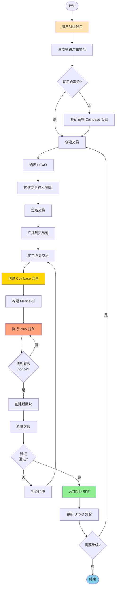
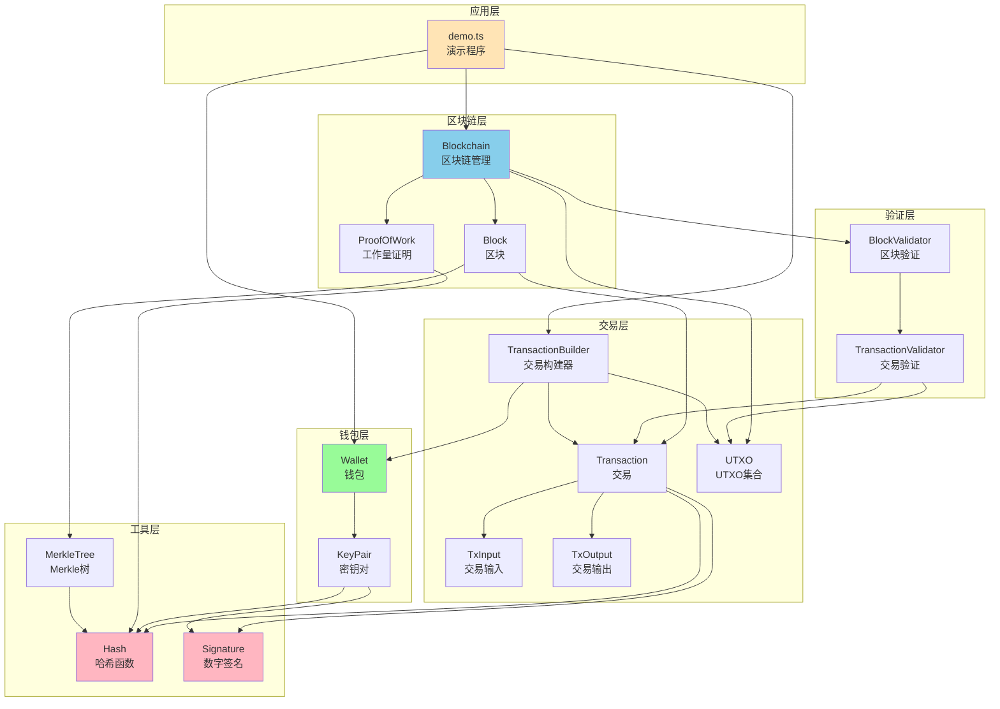
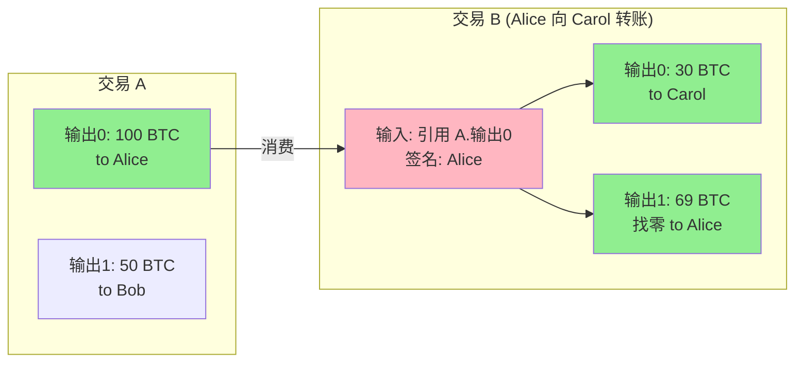
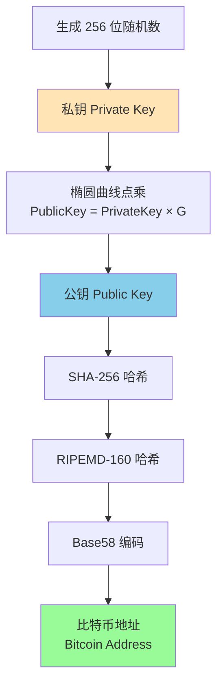
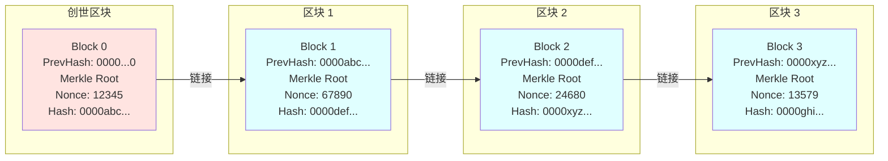
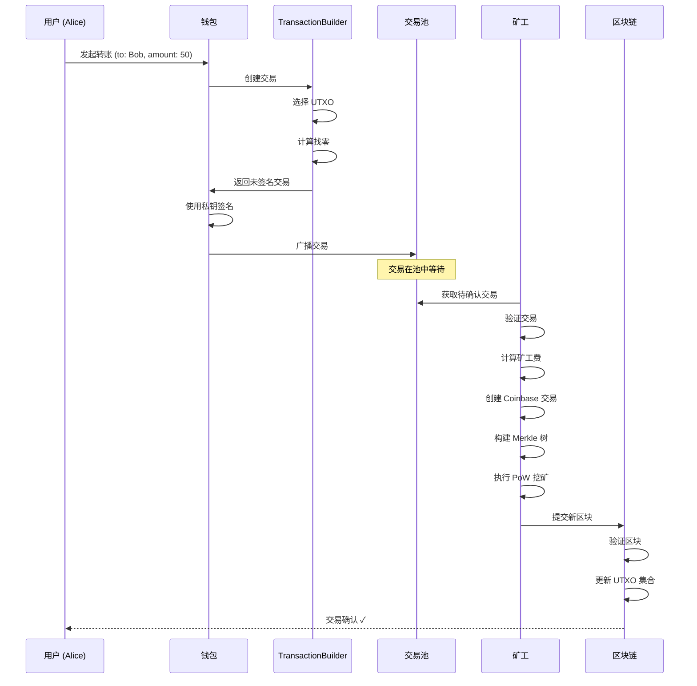
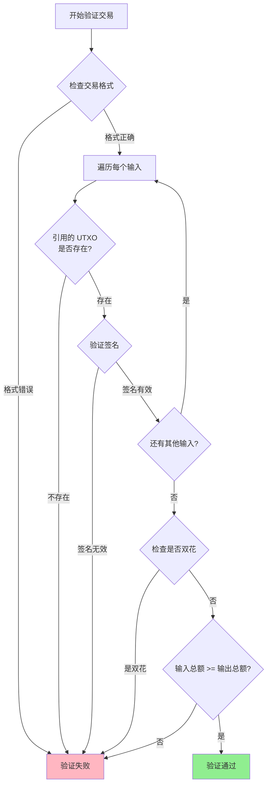
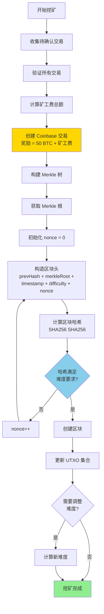

# 比特币系统技术设计文档

## 1. 系统概述

本项目是一个简化版的比特币系统实现，旨在展示比特币的核心技术原理。使用 TypeScript 实现，包含了 UTXO 模型、钱包系统、Merkle 树、工作量证明等核心组件。

### 1.1 核心特性

- **UTXO 模型**: 基于未花费交易输出的账户模型
- **椭圆曲线加密**: 使用 ECDSA (secp256k1) 进行数字签名
- **工作量证明**: 基于 SHA-256 的 PoW 共识机制
- **Merkle 树**: 高效的交易验证结构
- **动态难度调整**: 根据出块时间自动调整挖矿难度

### 1.2 系统整体工作流程



## 2. 系统架构

### 2.1 目录结构

```
bitcoin/
├── src/
│   ├── crypto/           # 密码学基础
│   │   ├── hash.ts       # 哈希函数
│   │   └── signature.ts  # 数字签名
│   ├── wallet/           # 钱包系统
│   │   ├── KeyPair.ts    # 密钥对
│   │   └── Wallet.ts     # 钱包
│   ├── transaction/      # 交易系统
│   │   ├── TxInput.ts    # 交易输入
│   │   ├── TxOutput.ts   # 交易输出
│   │   ├── UTXO.ts       # UTXO 集合
│   │   ├── Transaction.ts       # 交易
│   │   └── TransactionBuilder.ts # 交易构建器
│   ├── merkle/           # Merkle 树
│   │   └── MerkleTree.ts
│   ├── blockchain/       # 区块链核心
│   │   ├── Block.ts      # 区块
│   │   ├── Blockchain.ts # 区块链
│   │   └── ProofOfWork.ts # 工作量证明
│   ├── validator/        # 验证器
│   │   ├── BlockValidator.ts       # 区块验证
│   │   └── TransactionValidator.ts # 交易验证
│   └── examples/         # 示例
│       └── demo.ts       # 完整演示
└── docs/
    └── TECH_DESIGN.md    # 本文档
```

### 2.2 模块依赖关系图



## 3. 核心概念

### 3.1 UTXO 模型

UTXO (Unspent Transaction Output) 是比特币的核心账户模型。与传统的账户余额模型不同，UTXO 模型将每笔交易视为"消费旧输出，创建新输出"的过程。

**优势**:
- 天然支持并发处理（不同的 UTXO 可以并行验证）
- 易于检测双花攻击
- 隐私性更好（每次交易可以使用新地址）

**工作原理**:
1. 交易输入引用之前的 UTXO
2. 交易输出创建新的 UTXO
3. 输入总额必须 >= 输出总额
4. 差额作为矿工费

**UTXO 交易示意图**:



> 矿工费 = 100 - (30 + 69) = 1 BTC

### 3.2 数字签名 (ECDSA)

使用椭圆曲线数字签名算法 (ECDSA) 基于 secp256k1 曲线。

**密钥生成**:
1. 私钥: 256 位随机数
2. 公钥: 私钥 × G (G 是曲线的生成点)
3. 地址: Base58(RIPEMD160(SHA256(公钥)))

**签名流程**:
1. 计算交易哈希
2. 使用私钥对哈希进行签名
3. 生成签名 (r, s)

**验证流程**:
1. 使用公钥验证签名
2. 确认签名者拥有对应私钥

**地址生成流程图**:



### 3.3 Merkle 树

Merkle 树是一种二叉哈希树，用于高效验证区块中的交易。

**构建过程**:
```
        Root
       /    \
     H01    H23
    /  \   /  \
   H0  H1 H2  H3
   |   |  |   |
  Tx0 Tx1 Tx2 Tx3
```

**实现方式**:
- 纯指针式：使用对象引用（left/right）构建真正的树形结构
- 每个节点包含：hash（节点哈希）、left（左子节点引用）、right（右子节点引用）
- 递归构建：从叶子节点开始，逐层向上构建父节点

**优势**:
- 只需 O(log n) 的哈希即可验证某笔交易是否在区块中
- 轻节点可以只下载区块头，按需验证交易
- 指针式实现使代码更直观、类型更安全

### 3.4 工作量证明 (PoW)

工作量证明通过计算满足特定条件的区块哈希来保护区块链安全。

**挖矿过程**:
1. 构造区块（包含交易、前区块哈希、Merkle 根等）
2. 不断尝试不同的 nonce 值
3. 计算区块哈希 SHA256(SHA256(区块头))
4. 当哈希值小于难度目标时，挖矿成功

**难度目标**:
- 表示为前导零的个数
- 例如：难度 4 表示哈希必须以 "0000" 开头

**难度调整**:
- 每 10 个区块调整一次
- 目标出块时间: 10 秒
- 调整公式: `新难度 = 旧难度 × (目标时间 / 实际时间)`

**区块链结构示意图**:



## 4. 数据结构

### 4.1 交易输入 (TxInput)

```typescript
interface TxInput {
  txId: string;        // 引用的交易 ID
  outputIndex: number; // 引用的输出索引
  signature: string;   // 签名
  publicKey: string;   // 公钥
}
```

### 4.2 交易输出 (TxOutput)

```typescript
interface TxOutput {
  amount: number;   // 金额
  address: string;  // 接收地址
}
```

### 4.3 交易 (Transaction)

```typescript
interface Transaction {
  id: string;           // 交易 ID (交易内容的哈希)
  inputs: TxInput[];    // 输入列表
  outputs: TxOutput[];  // 输出列表
  timestamp: number;    // 时间戳
}
```

### 4.4 区块 (Block)

```typescript
interface Block {
  version: number;           // 版本号
  previousHash: string;      // 前区块哈希
  merkleRoot: string;        // Merkle 根
  timestamp: number;         // 时间戳
  difficulty: number;        // 难度
  nonce: number;             // 随机数
  transactions: Transaction[]; // 交易列表
  hash: string;              // 区块哈希
}
```

**区块结构详细图**:

```
┌─────────────────────────────────────────────────────────┐
│                      区块头 (Block Header)                │
├─────────────────────────────────────────────────────────┤
│  Version: 1                                             │
│  Previous Hash: 0000abc123...                           │
│  Merkle Root: def456789...                              │
│  Timestamp: 1700000000                                  │
│  Difficulty: 4                                          │
│  Nonce: 123456                                          │
├─────────────────────────────────────────────────────────┤
│                     区块哈希 (Block Hash)                 │
│              0000xyz987... (通过 PoW 计算)               │
├─────────────────────────────────────────────────────────┤
│                      交易列表 (Transactions)              │
├─────────────────────────────────────────────────────────┤
│  [0] Coinbase 交易 (矿工奖励)                            │
│      ├─ Inputs: []                                      │
│      └─ Outputs: [50 BTC -> Miner Address]             │
├─────────────────────────────────────────────────────────┤
│  [1] 普通交易                                            │
│      ├─ Inputs: [ref TX_A output 0]                    │
│      └─ Outputs: [30 BTC -> Bob, 19 BTC -> Alice]      │
├─────────────────────────────────────────────────────────┤
│  [2] 普通交易                                            │
│      ├─ Inputs: [ref TX_B output 1]                    │
│      └─ Outputs: [10 BTC -> Carol]                     │
└─────────────────────────────────────────────────────────┘
```

### 4.5 区块链 (Blockchain)

```typescript
class Blockchain {
  chain: Block[];              // 区块链
  difficulty: number;          // 当前难度
  utxoSet: Map<string, TxOutput>; // UTXO 集合
  pendingTransactions: Transaction[]; // 待打包交易
}
```

## 5. 脚本系统 (可选扩展)

### 5.1 脚本系统概述

比特币使用基于栈的脚本语言来定义交易的解锁条件。脚本系统提供了灵活性，支持多签名、时间锁、哈希锁等复杂功能。

#### 简化版 vs 脚本版对比

```typescript
// 简化版（当前实现）
interface TxInput {
  txId: string
  outputIndex: number
  signature: string     // 直接存储签名
  publicKey: string     // 直接存储公钥
}

interface TxOutput {
  amount: number
  address: string       // 直接存储地址
}

// 脚本版（扩展实现）
interface TxInput {
  txId: string
  outputIndex: number
  scriptSig: string     // 解锁脚本
  sequence: number
}

interface TxOutput {
  amount: number
  scriptPubKey: string  // 锁定脚本
}
```

### 5.2 脚本执行引擎

#### 5.2.1 Stack（栈）

```typescript
class Stack {
  private items: Buffer[]
  
  push(item: Buffer): void
  pop(): Buffer | undefined
  peek(): Buffer | undefined
  size(): number
  clear(): void
}
```

#### 5.2.2 Script（脚本执行器）

```typescript
class Script {
  private opcodes: OpCode[]
  
  constructor(script: string) {
    this.opcodes = this.parse(script)
  }
  
  // 解析脚本字符串为操作码序列
  parse(script: string): OpCode[]
  
  // 执行脚本
  execute(stack: Stack, transaction?: Transaction, inputIndex?: number): boolean
  
  // 序列化为字节码
  serialize(): Buffer
  
  // 反序列化
  static deserialize(buffer: Buffer): Script
}
```

### 5.3 操作码 (OpCodes)

#### 5.3.1 常量操作

```typescript
enum OpCode {
  // 常量
  OP_0 = 0x00,           // 推入空字节串
  OP_FALSE = 0x00,       // 等同于 OP_0
  OP_PUSHDATA1 = 0x4c,   // 推入接下来的 N 字节（N < 256）
  OP_PUSHDATA2 = 0x4d,   // 推入接下来的 N 字节（N < 65536）
  OP_1 = 0x51,           // 推入数字 1
  OP_TRUE = 0x51,        // 等同于 OP_1
  OP_2 = 0x52,           // 推入数字 2
  // ... OP_3 到 OP_16
}
```

#### 5.3.2 栈操作

```typescript
enum OpCode {
  OP_DUP = 0x76,         // 复制栈顶元素
  OP_DROP = 0x75,        // 移除栈顶元素
  OP_SWAP = 0x7c,        // 交换栈顶两个元素
  OP_PICK = 0x79,        // 复制栈中第 n 个元素到栈顶
  OP_ROLL = 0x7a,        // 移动栈中第 n 个元素到栈顶
}
```

#### 5.3.3 加密操作

```typescript
enum OpCode {
  OP_SHA256 = 0xa8,          // SHA-256 哈希
  OP_HASH160 = 0xa9,         // SHA-256 + RIPEMD-160 哈希
  OP_CHECKSIG = 0xac,        // 验证签名
  OP_CHECKMULTISIG = 0xae,   // 验证多重签名
}
```

#### 5.3.4 逻辑操作

```typescript
enum OpCode {
  OP_EQUAL = 0x87,           // 比较栈顶两元素是否相等
  OP_EQUALVERIFY = 0x88,     // OP_EQUAL + OP_VERIFY
  OP_VERIFY = 0x69,          // 栈顶为 false 则失败
  OP_RETURN = 0x6a,          // 标记交易输出为不可花费
}
```

### 5.4 标准脚本类型

#### 5.4.1 P2PKH (Pay-to-Public-Key-Hash)

最常见的交易类型，支付给公钥哈希。

```typescript
// 锁定脚本 (scriptPubKey)
OP_DUP OP_HASH160 <pubKeyHash> OP_EQUALVERIFY OP_CHECKSIG

// 解锁脚本 (scriptSig)
<signature> <publicKey>

// 执行过程：
// 1. Stack: [] 
// 2. 推入 signature: [signature]
// 3. 推入 publicKey: [signature, publicKey]
// 4. OP_DUP: [signature, publicKey, publicKey]
// 5. OP_HASH160: [signature, publicKey, hash(publicKey)]
// 6. 推入 pubKeyHash: [signature, publicKey, hash(publicKey), pubKeyHash]
// 7. OP_EQUALVERIFY: [signature, publicKey] (如果哈希匹配)
// 8. OP_CHECKSIG: [true] (如果签名有效)
```

**ScriptBuilder 构建**:

```typescript
class ScriptBuilder {
  // 构建 P2PKH 锁定脚本
  static buildP2PKHLock(pubKeyHash: Buffer): Script {
    return new Script()
      .pushOp(OpCode.OP_DUP)
      .pushOp(OpCode.OP_HASH160)
      .pushData(pubKeyHash)
      .pushOp(OpCode.OP_EQUALVERIFY)
      .pushOp(OpCode.OP_CHECKSIG)
  }
  
  // 构建 P2PKH 解锁脚本
  static buildP2PKHUnlock(signature: Buffer, publicKey: Buffer): Script {
    return new Script()
      .pushData(signature)
      .pushData(publicKey)
  }
}
```

#### 5.4.2 P2SH (Pay-to-Script-Hash)

支付给脚本哈希，允许接收者定义复杂的赎回条件。

```typescript
// 锁定脚本 (scriptPubKey)
OP_HASH160 <scriptHash> OP_EQUAL

// 解锁脚本 (scriptSig)
<data> ... <redeemScript>

// 验证分两步：
// 1. 验证 redeemScript 的哈希是否匹配
// 2. 执行 redeemScript 验证条件
```

**使用场景**: 多签钱包、托管交易、智能合约

#### 5.4.3 MultiSig (多重签名)

需要 m-of-n 个签名才能花费。

```typescript
// 2-of-3 多签锁定脚本
OP_2 <pubKey1> <pubKey2> <pubKey3> OP_3 OP_CHECKMULTISIG

// 解锁脚本
OP_0 <signature1> <signature2>

// OP_CHECKMULTISIG 验证：
// - 从栈中取出 n (3) 个公钥
// - 从栈中取出 m (2) 个签名
// - 验证至少 m 个签名有效
```

**注意**: OP_CHECKMULTISIG 有一个历史 bug，需要额外推入 OP_0

### 5.5 脚本执行流程

```
┌─────────────────────────────────────────────────────────┐
│  1. 准备阶段                                             │
├─────────────────────────────────────────────────────────┤
│  - 创建空栈                                              │
│  - 获取交易输入的 scriptSig                             │
│  - 获取引用 UTXO 的 scriptPubKey                        │
└─────────────────────────────────────────────────────────┘
                        ↓
┌─────────────────────────────────────────────────────────┐
│  2. 执行 scriptSig                                       │
├─────────────────────────────────────────────────────────┤
│  - 逐个执行 scriptSig 中的操作码                        │
│  - 将数据推入栈                                          │
└─────────────────────────────────────────────────────────┘
                        ↓
┌─────────────────────────────────────────────────────────┐
│  3. 执行 scriptPubKey                                    │
├─────────────────────────────────────────────────────────┤
│  - 在同一个栈上继续执行                                  │
│  - 执行验证操作（OP_CHECKSIG 等）                       │
└─────────────────────────────────────────────────────────┘
                        ↓
┌─────────────────────────────────────────────────────────┐
│  4. 检查结果                                             │
├─────────────────────────────────────────────────────────┤
│  - 如果栈顶为 true (非零值)，验证通过 ✓                │
│  - 否则验证失败 ✗                                        │
└─────────────────────────────────────────────────────────┘
```

### 5.6 安全限制

为防止 DoS 攻击和资源滥用，脚本执行需要以下限制：

```typescript
const SCRIPT_LIMITS = {
  MAX_SCRIPT_SIZE: 10000,           // 最大脚本大小（字节）
  MAX_SCRIPT_ELEMENT_SIZE: 520,     // 最大元素大小（字节）
  MAX_OPS_PER_SCRIPT: 201,          // 最大操作码数量
  MAX_STACK_SIZE: 1000,             // 最大栈深度
  MAX_PUBKEYS_PER_MULTISIG: 20,     // 多签最大公钥数
}
```

### 5.7 脚本验证器

```typescript
class ScriptValidator {
  // 验证交易输入的脚本
  validateInput(
    transaction: Transaction,
    inputIndex: number,
    utxoSet: UTXOSet
  ): boolean {
    const input = transaction.inputs[inputIndex]
    const referencedUTXO = utxoSet.get(input.txId, input.outputIndex)
    
    if (!referencedUTXO) {
      return false // UTXO 不存在
    }
    
    // 创建栈
    const stack = new Stack()
    
    // 解析脚本
    const scriptSig = Script.deserialize(input.scriptSig)
    const scriptPubKey = Script.deserialize(referencedUTXO.scriptPubKey)
    
    // 执行 scriptSig
    if (!scriptSig.execute(stack, transaction, inputIndex)) {
      return false
    }
    
    // 执行 scriptPubKey
    if (!scriptPubKey.execute(stack, transaction, inputIndex)) {
      return false
    }
    
    // 检查栈顶结果
    if (stack.size() === 0) {
      return false
    }
    
    const result = stack.pop()
    return this.isTrue(result)
  }
  
  private isTrue(value: Buffer): boolean {
    // 空字节或全零字节为 false
    if (value.length === 0) return false
    for (let i = 0; i < value.length; i++) {
      if (value[i] !== 0) {
        // 特殊情况：负零
        if (i === value.length - 1 && value[i] === 0x80) {
          return false
        }
        return true
      }
    }
    return false
  }
}
```

### 5.8 向后兼容

为保持简化版接口的可用性，提供兼容层：

```typescript
class TransactionCompat {
  // 将简化版转换为脚本版
  static toScriptMode(simpleTx: SimpleTransaction): ScriptTransaction {
    const scriptTx = { ...simpleTx, inputs: [], outputs: [] }
    
    // 转换输入
    for (const input of simpleTx.inputs) {
      const scriptSig = ScriptBuilder.buildP2PKHUnlock(
        Buffer.from(input.signature, 'hex'),
        Buffer.from(input.publicKey, 'hex')
      )
      
      scriptTx.inputs.push({
        txId: input.txId,
        outputIndex: input.outputIndex,
        scriptSig: scriptSig.serialize().toString('hex'),
        sequence: 0xffffffff
      })
    }
    
    // 转换输出
    for (const output of simpleTx.outputs) {
      const pubKeyHash = this.addressToPubKeyHash(output.address)
      const scriptPubKey = ScriptBuilder.buildP2PKHLock(pubKeyHash)
      
      scriptTx.outputs.push({
        amount: output.amount,
        scriptPubKey: scriptPubKey.serialize().toString('hex')
      })
    }
    
    return scriptTx
  }
  
  // 将脚本版转换回简化版（仅支持 P2PKH）
  static toSimpleMode(scriptTx: ScriptTransaction): SimpleTransaction
}
```

## 6. 核心算法

### 6.1 地址生成算法

```
1. 生成私钥 (256位随机数)
2. 计算公钥 = 私钥 × G (椭圆曲线点乘)
3. 计算 SHA-256(公钥)
4. 计算 RIPEMD-160(SHA-256结果)
5. Base58 编码得到地址
```

### 6.2 交易签名算法

```
1. 构造交易内容 (不含签名)
2. 序列化交易内容
3. 计算 SHA-256(交易内容)
4. 使用 ECDSA 私钥签名哈希
5. 将签名添加到交易输入中
```

**交易生命周期**:



### 6.3 交易验证算法

```
1. 检查交易格式是否正确
2. 验证每个输入的签名
3. 检查引用的 UTXO 是否存在
4. 验证输入总额 >= 输出总额
5. 检查是否存在双花
```

**交易验证流程图**:



### 6.4 UTXO 选择算法

构建交易时需要选择合适的 UTXO 作为输入：

```
1. 获取地址的所有可用 UTXO
2. 按金额从大到小排序
3. 贪心选择，直到总额 >= 目标金额
4. 计算找零金额 = 总输入 - 目标金额 - 矿工费
5. 如果找零 > 0，创建找零输出
```

### 6.5 Merkle 树构建算法（纯指针式）

我们使用纯指针式（对象引用）实现 Merkle 树，通过节点间的引用关系构建真正的树形结构：

```
1. 为每笔交易的哈希创建叶子节点对象（包含 hash、left、right 字段）
2. 两两配对构建父节点：
   - 如果节点数为奇数，最后一个节点自我配对
   - 创建父节点，设置 left 和 right 为子节点的引用
   - 计算父节点哈希 = SHA256(left.hash + right.hash)
3. 将父节点数组作为新的当前层
4. 递归执行步骤 2-3，直到只剩一个根节点
5. 根节点即为 Merkle 树的根

实现优势：
- 使用对象引用而非数组索引，代码更直观
- 保持完整的树结构，便于遍历和证明生成
- TypeScript 类型安全，编译时检查
```

### 6.6 工作量证明算法

```
1. 初始化 nonce = 0
2. 构造区块头 (previousHash + merkleRoot + timestamp + difficulty + nonce)
3. 计算 hash = SHA256(SHA256(区块头))
4. 检查 hash 是否满足难度要求 (前导零数量)
5. 如果不满足，nonce++，跳转到步骤 3
6. 如果满足，返回 nonce 和 hash
```

**挖矿流程图**:



### 6.7 难度调整算法

```
1. 每 10 个区块检查一次
2. 计算实际出块时间 = (当前块时间 - 第N-9块时间) / 10
3. 目标时间 = 10 秒
4. 如果实际时间 < 目标时间，难度 += 1 (增加难度)
5. 如果实际时间 > 目标时间 × 2，难度 -= 1 (降低难度)
6. 难度最小为 1
```

## 7. 安全性考虑

### 7.1 双花攻击防护

- 通过 UTXO 模型，每个输出只能被花费一次
- 交易验证时检查 UTXO 集合，拒绝重复花费
- 最长链原则确保已确认交易难以撤销

### 7.2 51% 攻击

- 攻击者需要控制超过 51% 的算力
- 成本随着网络算力增加而增加
- 本实现为教学目的，未考虑实际网络安全

### 7.3 签名安全

- 使用 secp256k1 椭圆曲线，与比特币相同
- 私钥永不传输，只传输签名和公钥
- 每个地址应只使用一次（隐私考虑）

## 8. 性能优化

### 8.1 UTXO 索引

使用 Map 数据结构存储 UTXO 集合，提供 O(1) 的查询性能。

键格式: `${txId}:${outputIndex}`

### 8.2 Merkle 树缓存

区块一旦创建，Merkle 根不会改变，可以缓存避免重复计算。

### 8.3 并行验证

不同区块的工作量证明可以并行验证，但本实现为简化保持串行。

## 9. 限制与简化

本实现为教学目的，做了以下简化：

1. **无网络层**: 未实现 P2P 网络通信
2. **无持久化**: 数据只保存在内存中
3. **简化的脚本**: 未实现比特币的脚本系统
4. **固定难度范围**: 难度值为简单的整数
5. **无区块大小限制**: 实际比特币有 1MB 限制
6. **无隔离见证**: 未实现 SegWit
7. **无交易池管理**: 简化的待确认交易处理

## 10. 扩展方向

1. **脚本系统** ⭐ (已规划 - 见 Milestone 4.5):
   - 实现基于栈的脚本引擎
   - 支持 P2PKH、P2SH、MultiSig
   - 提供向后兼容的简化模式

2. **P2P 网络**: 
   - 实现节点发现和区块广播
   - 实现 gossip 协议
   - 网络消息序列化和验证

3. **持久化存储**: 
   - 使用 LevelDB/SQLite 存储区块链
   - 实现 UTXO 集合的持久化
   - 区块链数据库索引优化

4. **轻节点支持**: 
   - 实现 SPV (简单支付验证)
   - Merkle 证明验证
   - 区块头同步

5. **高级交易类型**:
   - 时间锁交易 (CheckLockTimeVerify)
   - 相对时间锁 (CheckSequenceVerify)
   - 原子交换 (Atomic Swaps)

6. **隔离见证 (SegWit)**:
   - 分离签名数据
   - 解决交易延展性
   - 增加区块容量

7. **闪电网络**: 
   - 实现链下支付通道
   - HTLC (哈希时间锁定合约)
   - 路由和网络拓扑

8. **智能合约**: 
   - 扩展脚本系统功能
   - 实现图灵完备的虚拟机
   - 状态管理和合约存储

## 11. 参考资料

- [Bitcoin Whitepaper](https://bitcoin.org/bitcoin.pdf) - Satoshi Nakamoto
- [Mastering Bitcoin](https://github.com/bitcoinbook/bitcoinbook) - Andreas M. Antonopoulos
- [Bitcoin Developer Guide](https://developer.bitcoin.org/devguide/)
- [secp256k1 Curve](https://en.bitcoin.it/wiki/Secp256k1)

